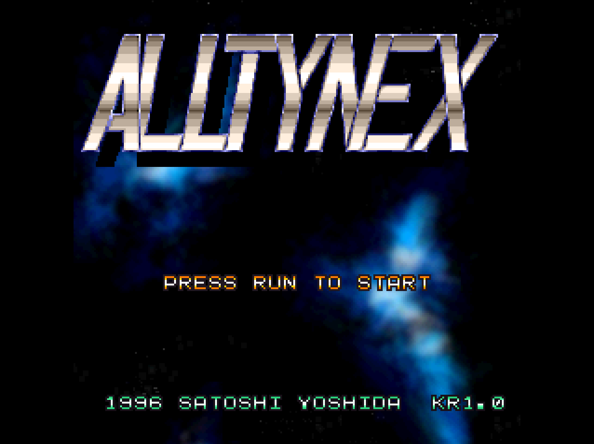

# FM Alltynex Localization Build

FM TOWNS용 Alltynex의 한글 패치 ISO를 만드는 프로젝트입니다. 번역 CSV와 HANME 조합형 폰트를 사용해 본문을 한글로 출력하며, 생성 ISO는 FreeTOWNSOS로 부팅한 뒤 게임을 자동 실행합니다.



## 실행 권장 환경

- **CPU:** 486급 FM TOWNS를 권장합니다.
- **메모리:** 4 MB 설정에서 한글 빌드의 엔딩까지 진행을 확인했습니다.
- **실행 확인 환경:** Tsugaru의 HG(386DX-20), 20 MHz, RAM 4 MB에서 FreeTOWNSOS 한글 ISO를 실행했습니다. 386급에서는 486 권장 환경과 같은 속도를 보장하지 않습니다.

## 시작하기

원본 Alltynex는 개발자가 [SITER SKAIN 배포 페이지](https://www.siterskain.com/artifact/)에서 무료로 제공하고 있습니다. **ALLTYNEX for FM TOWNS** 링크에서 받을 수 있습니다.

1. [한글 빌드 안내](doc/Alltynex-Korean-Build.md#1-시작하기)의 준비 항목을 확인합니다.
2. 프로젝트 루트에서 빌드합니다.

```powershell
python tools/build_alltynex_korean_freeos_from_zip.py
```

`Output`에 `Alltynex (Kor v1.0).iso`와 `Alltynex (Kor v1.0).xdelta`가 함께 생성됩니다. xdelta의 기준 파일은 압축을 풀지 않은 원본 `alltynex_fmtowns.zip`입니다.

Windows x64에서는 `tools/xdelta3.exe`에 포함된 [공식 xdelta3](https://github.com/jmacd/xdelta) v3.2.1을 사용합니다. 다른 환경에서는 xdelta3를 PATH에 설치하거나 `--xdelta3`로 실행 파일 경로를 지정합니다.

## xdelta로 ISO 생성하기

Windows x64에서는 포함된 `tools/xdelta3.exe`를 원본 ZIP·배포된 xdelta와 같은 폴더에 복사하고, 그 폴더에서 다음 명령을 실행합니다. ZIP은 압축 해제하지 않습니다.

```powershell
.\xdelta3.exe -d -D -R -s alltynex_fmtowns.zip "Alltynex (Kor v1.0).xdelta" "Alltynex (Kor v1.0).iso"
```

PATH에 설치된 xdelta3를 사용할 때는 명령의 `.\xdelta3.exe`를 `xdelta3`로 바꿉니다.

기준 ZIP의 SHA-256은 `19b662f038e50e99535f60dbe6e07a77e269f574ed9250d46fc0655bb2aa6b3a`입니다. 이 방법으로 적용할 때는 Python, 번역 CSV, 폰트, FreeTOWNSOS 입력 ISO를 따로 준비할 필요가 없습니다.

## 현재 적용 범위

| 대상 | 적용 내용 |
| --- | --- |
| 오프닝·스탭롤·엔딩 | EGB 본문 74행에 자모 조합 한글 출력 |
| 타이틀·메뉴·구역 안내 | SPR UI 77개 주소의 기존 영문·숫자 문자열 반영 |
| 타이틀·스코어 하단 | KR1.0 크레딧 |

일반 SPR UI의 한글 조합 출력은 현재 빌드 범위에 포함되지 않습니다.

## 문서

- [한글 빌드](doc/Alltynex-Korean-Build.md): 실행·번역·좌표·폰트·검증 안내
- [소스 분석](doc/Alltynex-Source-Analysis.md): 원본 실행 구조와 함수·자료·출력 경로
- [빌드 도구](tools/README.md): 코드 구성
- [문서 안내](doc/README.md): 목적별 읽는 순서

프로젝트 코드·문서의 라이선스는 [LICENSE](licenses/LICENSE), 폰트 고지는 [OFL](licenses/LICENSE-OFL.txt)에 있습니다. 현재 빌드가 사용하는 외부 자료의 적용 범위는 [라이선스와 외부 자료 고지](licenses/THIRD-PARTY-NOTICES.md)를 참조합니다.
